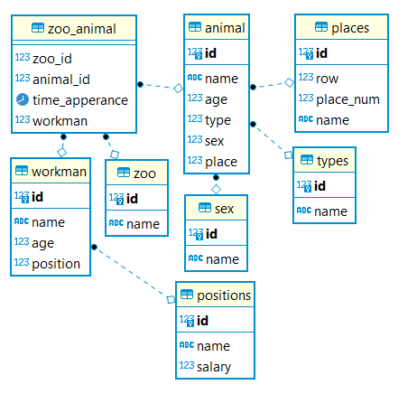

# Домашнее задание:
## БД:
Тесты написать с помощью Hibernate.

Создание сессии Hibernate сделать в HibernateSessionFactoryCreator.

BeforeAll обеспечивает создание базы, его не удалять :)

Каждый тест должен запускаться в рамках одного Session.

Схема базы данных:

Заполнить готовые методы с автотестами по условиям:

1. В таблице public.animal ровно 10 записей
2. В таблицу public.animal нельзя добавить строку с индексом от 1 до 10 включительно
3. В таблицу public.workman нельзя добавить строку с name = null
4. Если в таблицу public.places добавить еще одну строку, то в ней будет 6 строк
5. В таблице public.zoo всего три записи с name 'Центральный', 'Северный', 'Западный'

## API
Автоматизировать проверки методов сервиса https://petstore.swagger.io/#/

POST /pet
GET /pet/{petId}
PUT /pet
DELETE /pet/{petId}

Необходимо продумать минимум 4 теста (минимум по одному тесту на метод)

Дополнительные тесты приветствуются, так же можно писать тесты на негативные сценарии.

Требования:
Все тесты должны проходить
Использовать RestAssured в качестве клиента.